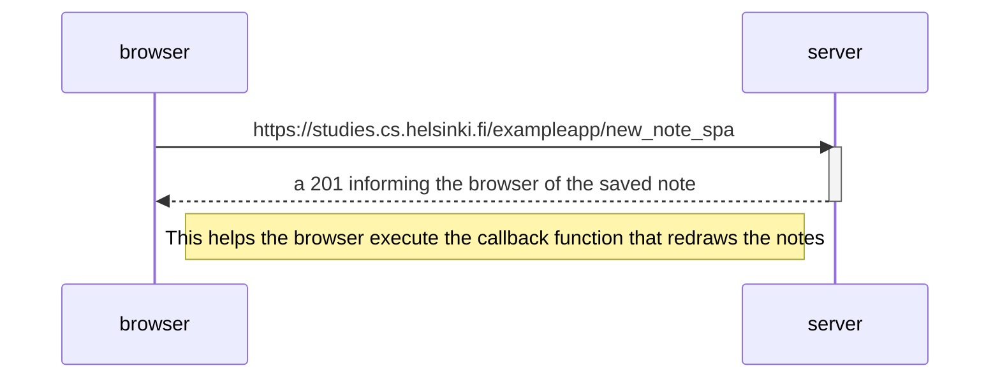

```mermaid
sequenceDiagram
    participant browser
    participant server

    browser->>server: https://studies.cs.helsinki.fi/exampleapp/new_note_spa
    activate server
    server-->>browser: a 201 informing the browser of the saved note
    deactivate server

    Note right of browser: This helps the browser execute the callback function that redraws the notes

```